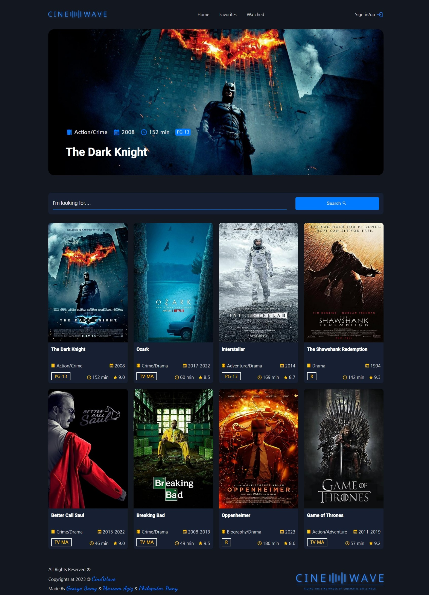

# CineWave



## Table of contents

-   [Overview](#overview)
    -   [The challenge](#the-challenge)
    -   [Links](#links)
-   [Our process](#our-process)
    -   [Built with](#built-with)
    -   [What we learned](#what-we-learned)
    -   [Useful resources](#useful-resources)
    -   [How To Use](#how-to-use)
-   [Authors](#authors)

## Overview

CineWave is a web application built using Angular and Java Spring Boot. It allows users to register, log in, search for movies or series, and manage their watched and favorite lists. The application integrates with the OMDB API for movie and series data and uses MongoDB for user database management.

### The challenge

Users should be able to:

-   Register and log in to their accounts.
-   Delete their accounts completely.
-   Search for movies or series and view detailed information.
-   Add movies or series to their watched list.
-   Add movies or series to their favorites list.
-   View their watched or favorites pages and search for movies there.

### Links

-   Live Site URL: [Github Pages](https://philopaterhany.github.io/CineWave/)
-   LinkedIn Post Containing the Demo Video: [Post]()

## Our process

### Built with

-   Semantic HTML5 Markup
-   CSS Custom Properties
-   AngularJS
-   TypeScript
-   Java Spring Boot
-   MongoDB
-   Postman API (for testing)
-   Sweetalert2 (for pop-ups)
-   OMDB API (for movie and series data)

### What We learned

```ts

```

```java

```

### Useful resources

-   [AngularJS Docs](https://angular.io/docs)
-   [Sweetalert2](https://sweetalert2.github.io/)
-   [Java Spring Boot Documentation](https://spring.io/projects/spring-boot)
-   [MongoDB Documentation](https://www.mongodb.com/docs/)
-   [OMDB API Documentation](https://www.omdbapi.com/)
-   [Material Icons](https://developers.google.com/fonts/docs/material_icons)

### How To Use

To use CineWave, follow these steps:
-   Download the repository as a zip folder.
-   Install the required front-end dependencies by running the following terminal command `npm install`.
-   Put your OMDB API key in a file `APIKEY.txt` in the following path `CineWave\CineWave_Backend\src\main\java\com\cinewave\movieapi`.
-   Connect to the user database in `CineWave\CineWave_Backend\src\main\resources\application.properties`.
-   Run the back-end server on your device by running `CineWave\CineWave_Backend\src\main\java\com\cinewave\core\UserController.java`.
-   Open your browser and go to `localhost:4200/`.
-   Enjoy the experience!

## Authors

CineWave was created by:
-   Github Account: [George Samy](https://github.com/GeorgeBeshay)
-   Github Account: [Mariam Aziz](https://github.com/MariamAziz0)
-   Github Account: [Philopater Hany](https://github.com/PhilopaterHany)
